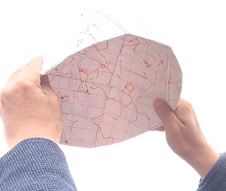

## 裏返し鏡像天球儀
天球儀の鏡像を利用して、観測地点、観測日時での実際の星空と一致する歪みのない天球面を再現します。
鏡像天球面を内側に折り込むことにより、折り込まれた内側面に、実際の星空と同じ天球面が再現されます。｡

原理や折り込み方法、詳しい説明については、『星座早見用の鏡像天球儀』天文教育，2021年3月号(Vol.33,No.2)pp.72-75．をご覧下さい。

### 使用方法（簡易版）
1. 星図を印刷して鏡像天球儀を作成します。日本からは見えない赤緯-70度以南を切り取ると作成しやすいです。
2. 観測日時の天頂位置が中心となるように、鏡像天球儀を半球に折り込みます。
3. 北極星の方向を北にむけて、内側面を見つめると、観測日時の星空になっています。

### 鏡像天球儀を作成する
[WEB版鏡像天球儀ジェネレーター](https://futr.github.io/tenkyu-webui/)

[Windows用鏡像天球儀ジェネレーター](https://github.com/futr/tenkyu2/releases/tag/v1.0)

## About
(c) 2021 高橋徹
