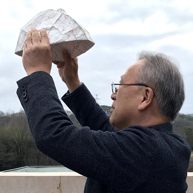
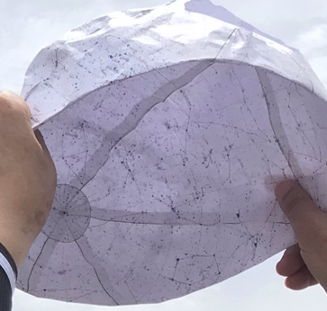
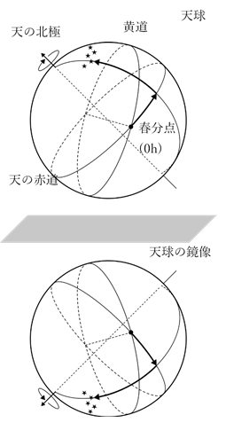
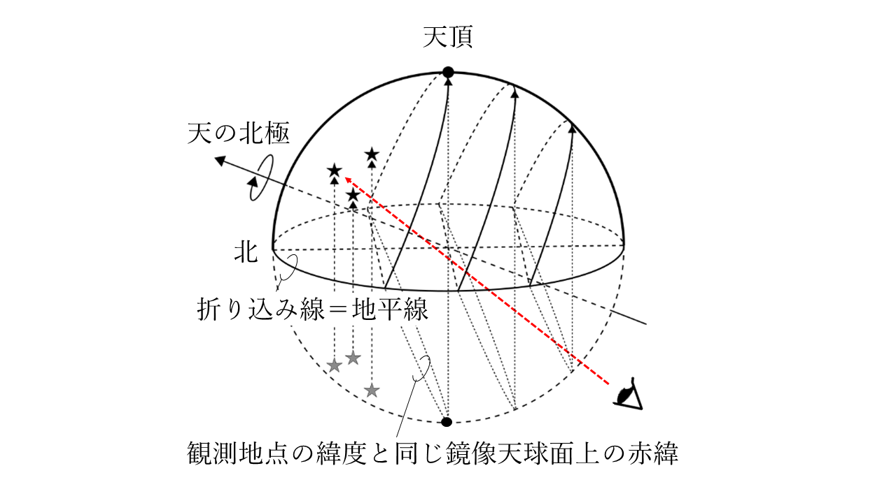

## 裏返し鏡像天球儀
天球儀の鏡像を利用して、観測地点、観測日時での実際の星空と一致する歪みのない天球面を再現します。
鏡像天球面を内側に折り込むことにより、折り込まれた内側面に、実際の星空と同じ天球面が再現されます。

原理や折り込み方法、詳しい説明については、『星座早見用の鏡像天球儀』天文教育，2021年3月号(Vol.33,No.2)pp.72-75．をご覧下さい。

### 使用方法（簡易版）
1. 星図を印刷して鏡像天球儀を作成します。日本からは見えない赤緯-70度以南を丸く切り取ると作成しやすいです。
2. 観測日時の天頂位置が中心となるように、鏡像天球儀を内側に折り込みます。つまり、天頂位置が半球面内側の中心に来るように折り込みます。
3. 北極星の位置を北にむけて、内側面を見つめると、観測日時の星空になっています。

<a href="img1.png"></a>
<a href="img2.png"></a>
<a href="img6.png"></a>

### 鏡像天球儀を作成する
[WEB版鏡像天球儀ジェネレーター](https://futr.github.io/tenkyu-webui/)

[Windows用鏡像天球儀ジェネレーター](https://github.com/futr/tenkyu2/releases)


### 観測日時での天頂位置の簡易導出法
天頂の赤緯は観測地点の緯度に一致します。

#### 天頂の赤経の簡易導出方法
観測日時が`m月d日T時`（24時換算）であるとします。天頂の赤経Aはおおよそ以下の式で計算できます。
```
A(度) = 春分点からの日数 + 15(T-12) + 地域の標準時子午線からの観測地経度のずれ（東は＋，西は－）
```
日本では、観測地の経度をEで表すと
```
A(度) ≒ 30(m-3) + (d-20) + 15(T-12) + (E-135)
A(h) = A(度)/15 ≒ 2(m-3) + (d-20) / 15 + (T-12) + (E-135) / 15
```
となります。

鏡像天球儀ジェネレーターでは、観測地にあわせた天頂の赤緯、観測月20日ころの午後8時および午後9時の天頂の赤経がわかるように記しています。
（この赤経はおおよそのめやすであり月ごとに日数が違うことや標準時子午線からのずれなどは考慮に入れていません。）

また、観測地の観測日時での天頂位置も表示できるようにしています。（協定世界時と観測地情報から赤経位置を算出していますが，赤緯の補正はしていません。）

### 原理の簡単な説明
天球儀は星空の配置を球面上に表わしてこれをその外からみつめたものになっています（図の上側）。
これを内側から見ることができれば、実際の星空を再現することができます。

これは、鏡像射影（面対称：面にたいして垂直方向（奥行き方向）を反転する）を2回繰り返すことで実現できます。

まず、天球の鏡像をつくります（図の下側）。

<p align="center"><a href="img4.png"></a></p>

次にこの鏡像天球面を内側に折り込めば、鏡像の鏡像が、すなわち実際の星空が球面の内側に（半球面分だけ）再現されることになります。

観測日時における天頂が内側半球面の中心になるように折り込めば、観測日時の星空を再現できます。
このとき半球面の端がその日時の地平線になります。

<p align="center"><a href="img7.png"></a></p>

## About
(c) 2021 高橋徹
